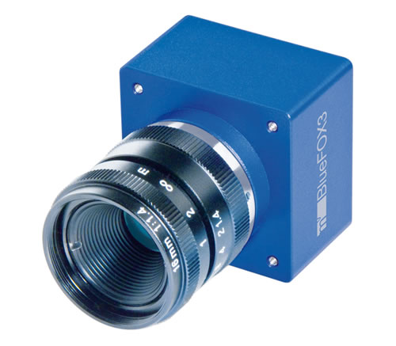
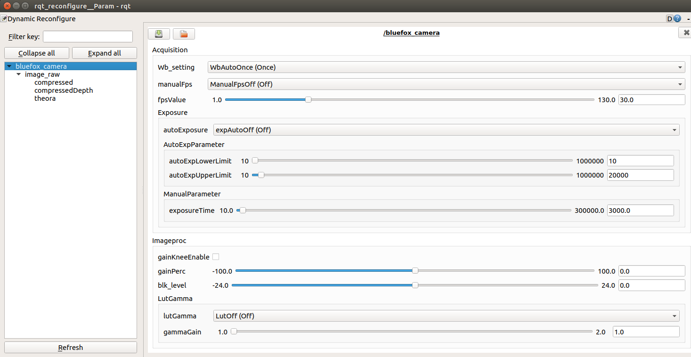

## mvBlueFOX3 (USB 3.0) ROS1 PACKAGE


Package to use bluefox mvBlueFOX3 (USB 3.0). 

 <br/>

[link web: mvBlueFOX3-1](https://www.matrix-vision.com/en/products/MP11538315)

tested on ros1: 
- [ROS Melodic Morenia](https://wiki.ros.org/melodic)
- [ROS Noetic Ninjemys](http://wiki.ros.org/noetic)


---

## Installation

It doesn't work imho....

The installation is two-steps process: you first need to install the driver according 
to your hardware platform: x-86_64 or arm 64. 

Clone this repository inside your ros1 workspace (i.e. catkin_ws) and source it. 

### Driver installation

Create a folder and download the corresponding drivers from the official page (you need to provide your email):

-  [x86_x64](https://www.matrix-vision.com/en/downloads/drivers-software/mvbluefox3-usb-3-0/linux-2-6-4-x-x) <br>
  - install_mvGenTL_Acquire.sh
  - mvGenTL_Acquire-x86_64_ABI2-2.49.0.tgz
```shell 
sudo chmod +x install_mvGenTL_Acquire.sh
./install_mvGenTL_Acquire.sh
```

- [Arm based](https://www.matrix-vision.com/en/downloads/drivers-software/mvbluefox3-usb-3-0/arm-based-embedded-devices) <br>
  
    Install the prerequisites:
  - libc (glibc, eglibc or similar) version >= 2.19
  - gcc version >= 4.9.4
  - ARM hardware with ARMv7-a architecture or newer, which supports the Thumb-2 instruction set-

  
  - install_mvGenTL_Acquire_ARM.sh
    - armh: mvGenTL_Acquire-ARMhf_gnueabi-2.49.0.tgz
    - arm64: mvGenTL_Acquire-ARM64_gnu-2.49.0.tgz

```shell 
sudo chmod +xinstall_mvGenTL_Acquire_ARM.sh
./install_mvGenTL_Acquire_ARM.sh
```

**Note** Both the two files (.sh and the .tgz archive) must be in the same directory.
#### Testing the driver installation 
If the installation succeeded a folder called "mvImpac_Acquire" would be created on 
the /opt/ directory. 
Move into the apps folder and launch the PropView tool:

```shell 
cd /opt/mvImpact_Acquire/apps/mvPropView
cd arm64
./wxPropView
```

The last folder "arm64" would be different according to your platform. 

If the software recognize the attached cameras the driver is successfully installed.


### Ros package installation 

Once the driver is installed, compile the package

```shell 
cd <your catkin workspace>
catkin_make
```

#### testing the ros package

launch the roscore and the bluefox_mono_node:

```shell 
roscore
```

```shell 
rosrun bluefox_mono_ros bluefox_mono_node
```

If the package is correctly installed you should see your camera:
```shell 
[ INFO] [1688468078.239913467]: ++ starting application....
[0]: F0700041 (mvBlueFOX3-1013C, Family: mvBlueFOX3, interface layout: GenICam, acquisition start/stop behaviour: User)
[1]: VD000001 (VirtualDevice, Family: mvVirtualDevice, interface layout: DeviceSpecific, acquisition start/stop behaviour: Default)
[2]: VD000002 (VirtualDevice, Family: mvVirtualDevice, interface layout: DeviceSpecific, acquisition start/stop behaviour: Default)

Please enter the number in front of the listed device followed by [ENTER] to open it: 
```

After selecting the device, the node will start acquiring, providing some info:

```shell 
[ INFO] [1688468108.980174745]: Initialising device: F0700041. This might take some time...

[ INFO] [1688468108.980279900]: Using interface layout 'GenICam'.

[ INFO] [1688468109.844389885]: Device set up to BGR8Packed 1280x1024 fps:2250

[ INFO] [1688468109.850749332]: starting live loop
[ INFO] [1688468110.167976575]:  == liveLoop - establish access to the statistic properties....
[ INFO] [1688468110.171406766]:  == liveLoop - create an interface to the device found....
[ INFO] [1688468110.177991836]: 10 buffers requested
[ INFO] [1688468110.178115638]: max request count: 32767
[ INFO] [1688468110.178183502]: 
Press <<ENTER>> to end manually the application!!
[ INFO] [1688468110.293617707]: using default calibration URL
[ INFO] [1688468110.293892393]: camera calibration URL: file:///home/nvidia/.ros/camera_info/Bluefox_mono.yaml
[ INFO] [1688468111.925205512]: Info From F0700041 :
->Image count: 100 
->FramesPerSecond : 60.880351 
->ErrorCount : 0 
->CaptureTime_s : 0.157034 
->Image dimension: 1280 x 1024 , format: RGB888Packed , line pitch : 3840
```

The following topics will be published:
```shell 
/bluefox_camera/camera_info
/bluefox_camera/image_raw
/bluefox_camera/image_raw/compressed
/bluefox_camera/image_raw/compressed/parameter_descriptions
/bluefox_camera/image_raw/compressed/parameter_updates
/bluefox_camera/image_raw/compressedDepth
/bluefox_camera/image_raw/compressedDepth/parameter_descriptions
/bluefox_camera/image_raw/compressedDepth/parameter_updates
/bluefox_camera/image_raw/theora
/bluefox_camera/image_raw/theora/parameter_descriptions
/bluefox_camera/image_raw/theora/parameter_updates
/bluefox_camera/parameter_descriptions
/bluefox_camera/parameter_updates
```

---

## Adjusting the camera parameters

It is possible to adjust some camera parameters using the reconfigure tool:

```shell 
rosrun rqt_reconfigure rqt_reconfigure
```


 <br/>
